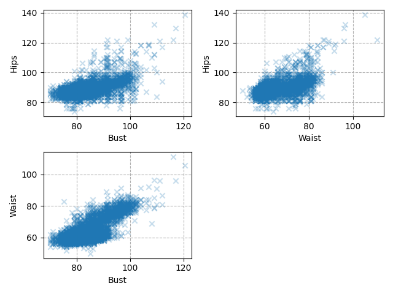
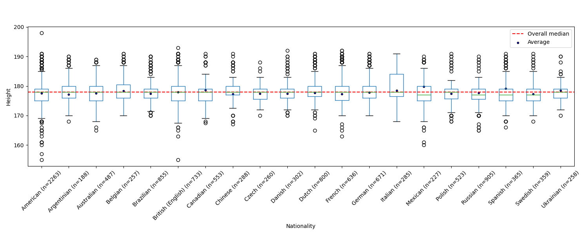
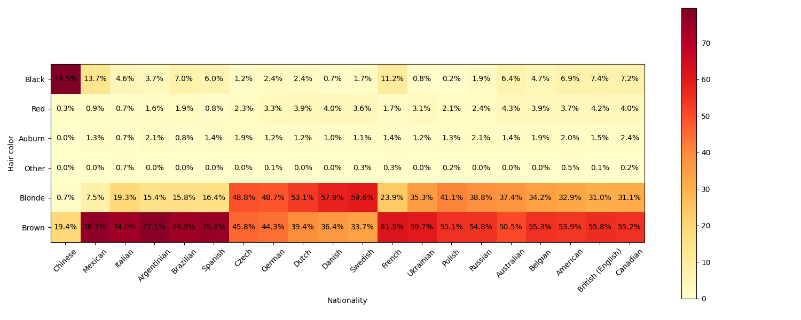
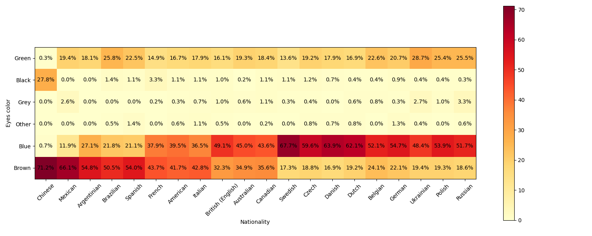

# Models

We have implemented a python3 script based on our humble scraping library to retrieve informations from the [Fashion Model Directory](https://www.fashionmodeldirectory.com/) (FMD). A similar work have been made in [1].

## Methodology
To run the script:
```
python3 fashionmodeldirectory.py
```

It will retrieve data from more than 15 thousand personal records (as of 2025) and look for simple inconsistencies. When values are unavailable or wrong, `NA` is written. On our machine it run for about 4 hours.

The retrieved data are saved in .csv form. They are:

- Name and surname of the model (string)
- FMD page (string)
- Nationality (string)
- Birth date (string)
- Height in cm (float)
- Bust size in cm (float)
- Waist size in cm (float)
- Hips size in cm (float)
- Dress size (EU) (string/float)
- Shoes size (EU) (float)
- Color of the hair (string)
- Color of the eyes (string)

For example, this is the vector corresponding to [Monica Bellucci](https://www.fashionmodeldirectory.com/models/monica_bellucci/):
```
Monica Bellucci,https://www.fashionmodeldirectory.com/models/monica_bellucci/,Italian,September 30 1964,175.0,90.0,61.0,90.0,36,40,Dark brown,Brown
```

## Results
The dataset contains 15030 people in total.

### Quality
Most of the birth dates are missing.


Name and url are always available.

### Descriptive analysis


|        |  Name | Nationality | Birth date |     Height |       Bust |      Waist |       Hips | Dress |     Shoes |  Hair |  Eyes |
| ------ | ----- | ----------- | ---------- | ---------- | ---------- | ---------- | ---------- | ----- | --------- | ----- | ----- |
| count  | 15030 |       15009 |       5071 |      14988 |      14967 |      14916 |      14965 | 14847 |     14372 | 15011 | 15011 |
| N/A    |     0 |          21 |       9959 |         42 |         63 |        114 |         65 |   183 |       658 |    19 |    19 |
| unique | 15030 |         140 |       3468 |            |            |            |            |    36 |           |    19 |    17 |
| freq   |     1 |        2263 |         99 |            |            |            |            |  5110 |           |  5094 |  4733 |
| mean   |       |             |            |     177.85 |      83.45 |      61.89 |      88.60 |       |     39.80 |  |  |
| std    |       |             |            |       3.76 |       4.65 |       4.55 |       3.06 |       |      1.70 |  |  |
| min    | | | | [155.0](https://www.fashionmodeldirectory.com/models/celine_joiris/) | [70.0](https://www.fashionmodeldirectory.com/models/li_fuyao/) | [50.0](https://www.fashionmodeldirectory.com/models/gabriella_buhlin/) | [74.0](https://www.fashionmodeldirectory.com/models/luis_liranzo/)        |       |      35.0 |  |  |
| 25%    |       |             |            |      175.0 |       81.0 |       60.0 |       87.0 |       |      39.0 |  |  |
| 50%    |       |             |            |      178.0 |       83.0 |       61.0 |       89.0 |       |      39.0 |  |  |
| 75%    |       |             |            |      180.0 |       86.0 |       62.0 |       90.0 |       |      41.0 |  |  |
| max    | | | | [198.0](https://www.fashionmodeldirectory.com/models/dusty_lachowicz/) | [120.5](https://www.fashionmodeldirectory.com/models/lovisa_lager/) | [111.0](https://www.fashionmodeldirectory.com/models/ceval_omar/) | [138.5](https://www.fashionmodeldirectory.com/models/lovisa_lager/)  |       |      48.0 |  |  |





We grouped the colors of the eyes and the hair according to the following tables:

|              | Count | Group (5) |
| ------------ | ----- | ------ |
| Brown        |  5094 | Brown  |
| Blonde       |  3221 | Blonde |
| Dark brown   |  1623 | Brown  |
| Black        |  1550 | Black  |
| Light brown  |  1365 | Brown  |
| Dark blonde  |  1145 | Blonde |
| Red          |   335 | Red    |
| Light blonde |   237 | Blonde |
| Auburn       |   142 | Auburn |
| Blonde / red |    73 | Blonde |
| Red / blonde |    61 | Red    |
| Chestnut     |    52 | Brown  |
| Red / brown  |    39 | Auburn |
| Brown / red  |    35 | Auburn |
| Grey         |    13 | Other  |
| Red blonde   |    10 | Red    |
| White        |     8 | Other  |
| Light red    |     6 | Red    |
| bald         |     2 | Other  |

|               | Count | Group (4) |
| ------------- | ----- | ----- |
| Blue          |  4733 | Blue  |
| Brown         |  4438 | Brown |
| Green         |  2413 | Green |
| Blue / green  |   949 | Blue  |
| Hazel         |   867 | Brown |
| Blue / grey   |   390 | Blue  |
| Black         |   373 | Black |
| Dark brown    |   282 | Brown |
| Green / grey  |   173 | Green |
| Grey          |   102 | Grey  |
| Green / brown |    89 | Green |
| Green / hazel |    77 | Green |
| Brown / green |    71 | Brown |
| Light brown   |    42 | Brown |
| Brown / hazel |    10 | Brown |
| Dark green    |     1 | Green |
| Blue / brown  |     1 | Blue  |






### Predicitive analysis
In the dataset men and women are mixed. Differences in size and proportions between male and female body have been studied [2], hence we have been trying to distinguish the sexes of the models looking at the distribution of the collected data.


It seems that there are two distinct Gaussian distributions.

## References
1. Topirceanu, A., & Udrescu, M. (2015, September). *FMNet: Physical Trait Patterns in the Fashion World*. In Network Intelligence Conference (ENIC), 2015 Second European (pp. 25-32). IEEE.
2. Robinette, K.M., Churchill, T., & Mcconville, J.T. (1979). [*A Comparison of Male and Female Body Sizes and Proportions*](https://apps.dtic.mil/sti/pdfs/ADA074807.pdf).
